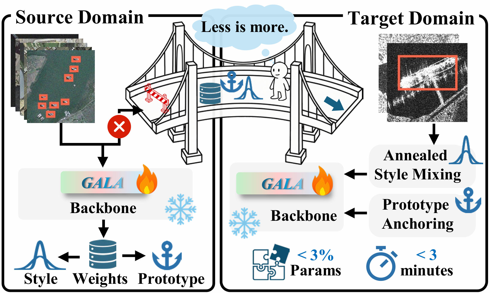

# Omni-Tuner

**Omni-Tuner: Parameter-Efficient Adaptation for Source-Free Few-Shot Object Detection in Earth Observation**

<p align="center">
  
</p>

## 📌 Overview

This project implements **Source-Free Few-Shot Domain Adaptive Object Detection (SF-FSDAOD)** for remote sensing.
With a Swin-Large backbone, it adapts using **<3% trainable parameters** and finishes target-domain adaptation **within 3 minutes**, outperforming full fine-tuning.

## ✨ Highlights

- SF-FSDAOD tailored for remote-sensing object detection
- Built on **MMDetection**
- <3% trainable parameters on Swin-Large
- Target-domain adaptation within 3 minutes, superior to full fine-tuning

## 🧩 Environment Setup

This project is based on MMDetection. Please follow [`env/begin.md`](env/begin.md) **exactly** for environment setup.

> Note: the file contains the full installation steps matching MMDetection/MMCV versions.

## 📂 Dataset

Place datasets under `dataset/`. The six datasets used in our experiments are already registered.

For convenience, you can also download our pre-organized full datasets:

- [Google Drive](https://drive.google.com/drive/folders/1S2XLjt6TqtOenr94vd254AayxeNqf1K_?usp=sharing)
- [Baidu Yun (pwd: DATA)](https://pan.baidu.com/s/1lYdr06Wdo89NnTuDFXX2_Q?pwd=DATA)

Example structure:

```
dataset
├── xview3c
│   ├── VOC2007
│   ├── ├── JPEGImages
│   ├── ├── Annotations
│   ├── └── ImageSets
├── hrrsd1c
├── ssdd1c_fs
└── ...
```

## 🚀 Quick Start (xView → DOTA)

All launch scripts are in `tool_sh/`.

### 1) Source-domain training

```bash
bash tool_sh\train_source_xview.sh
```

### 2) Offline source-domain extraction

```bash
bash tool_sh\extract_xview_all_in_one.sh
```

### 3) Target-domain fine-tuning

```bash
bash tool_sh\run_target_dota.sh
```

## 📁 Main Directories

- `Omni_Tuner_configs/`: Omni-Tuner configs
- `prototype_tools/`: prototype/statistics extraction tools
- `tool_sh/`: one-click experiment scripts
- `dataset/`: datasets

## 📄 License

Released under the [MIT License](LICENSE).

## 🙏 Acknowledgements

- [MMDetection](https://github.com/open-mmlab/mmdetection)
- [Swin Transformer](https://github.com/microsoft/Swin-Transformer)
- [MONA](https://github.com/Leiyi-HU/mona)
